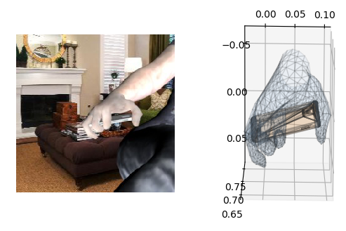

ObMan dataset
=============

# Download required files

## Get data

Request the dataset on the [ObMan webpage](https://www.di.ens.fr/willow/research/obman/data/)

## Download object meshes

- Download object models from ShapeNet
  - Create an account on [shapenet.org](https://www.shapenet.org)
  - Download models from [download page](https://www.shapenet.org/download/shapenetcore)

## Download dataset images and data

- https://filesender.renater.fr/?s=download&token=95222f3b-8352-b59e-aec7-226b8507d3c0
- unzip obman.zip to /path/to/obman
- Your dataset structure should look like

```
obman/
  test/
    rgb/
    rgb_obj/
    meta/
    ...
  val/
    rgb/
    rgb_obj/
    meta/
    ...
```

# Download code

`git clone https://github.com/hassony2/obman`

`cd obman`

# Load samples

`python readataset --root /path/to/obman --shapenet_root /path/to/ShapeNetCore.v2 --split test --viz`

Options you might be interested in `--segment` which keeps only the foreground `--mini_factor 0.01` to load only 1% of the data (to speed-up loading)

## Visualizations

### Hand object and mesh in camera coordinates



### Projected in pixel space

Hand vertices in blue, object vertices in red.


